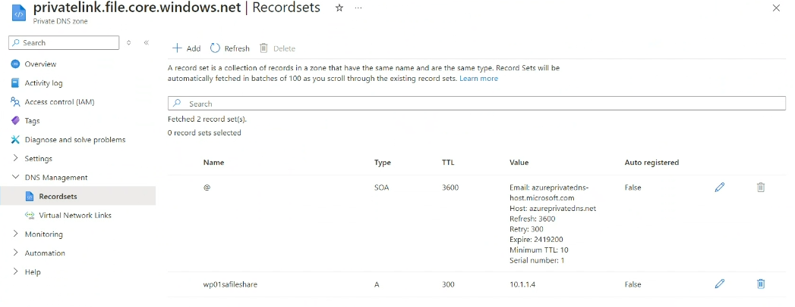

# Security Considerations

## 1. Private Network Communication using Private Endpoint only

- VNet Peering ensures that all communication between the two offices remains within Azure’s private network, reducing exposure to the public internet. Additionally, we are using Private EndPoint Services which ensures Storage Accounts accessed only internally through endpoint DNS.

## 2. Identity and Access Management

- We use Azure Active Directory (AAD) to manage access to resources.
- Additionally, Multi-factor authentication (MFA) for additional security.

## 3. Network Security Groups (NSGs)

- NSGs control inbound and outbound traffic. Our configured rules only permit necessary traffic between the US and EU subnets, and block any other connections by default.

## 4. Monitoring and Logging

- Used **Log Analytics** for real-time monitoring and logging of network traffic, authentication attempts, and encryption statuses.

As an example, File Share performance from US region user is monitored and shown on performance dashboard. Other metrics can be added as needed.

## 5. FileShare Access using Private EndPoint and DNS Records

The secure connection between File share goes through Private Endpoint which is resolved through private DNS records for US region internal file access.

### **Private Endpoint**

### **DNS Record Entry**

### **Network Access disabled**

Storage Account access is disabled by default, so it should not be accessible even within network; if this request is not coming from source and also from allowed source.

