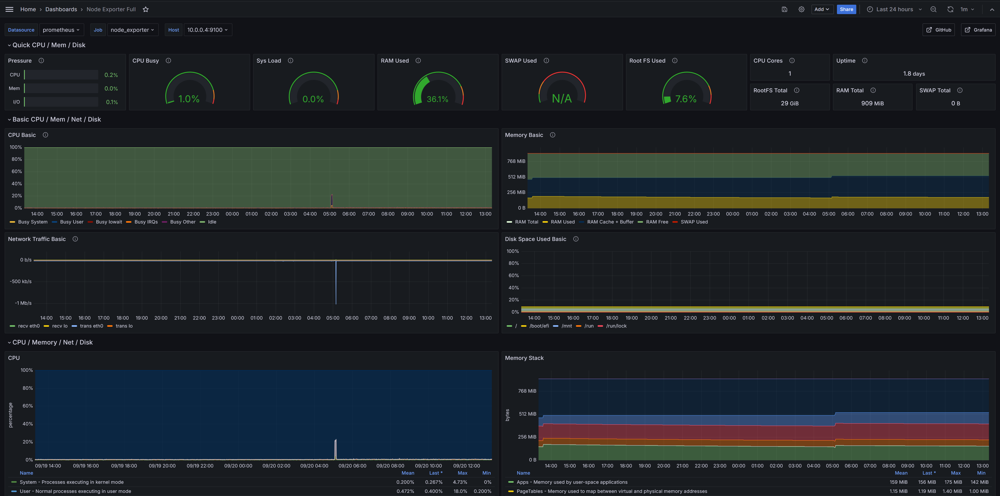
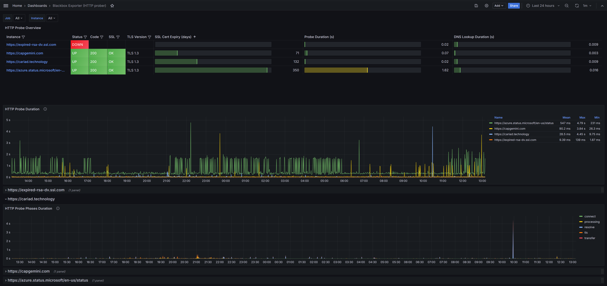
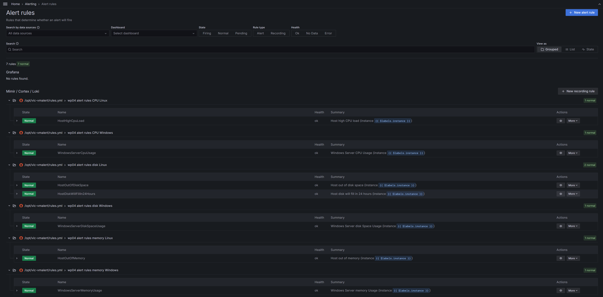

# EngIT Frame - tech task - mon / log / alert

## Architecture
The monitoring setup is based on VictoriaMetrics and Grafana. VictoriaMetrics is used to monitor 3 Linux and 3 Windows VMs via node_exporter and windows_exporter respectively. In addition, a blackbox_exporter is used to monitor the availability and the TLS certificate status of three web pages.


The dashed lines for Azure Monitor and Azure Blob Storage are not part of the terraform configuration in this repository and are illustrative for the file share monitoring concept described further below.

### **VictoriaMetrics**
VictoriaMetrics is an open-source time series database compatible with Prometheus and serves as the central data store for metrics and is also responsible to scrape the target exporters and ingest the metric data. On each Linux VM, a node_exporter is installed to expose CPU, memory and disk related metrics. The Windows VMs have windows_exporter installed to expose the same metrics.

VictoriaMetrics scrapes the exporters of all VMs via HTTP GET requests to port 9100 (node_exporter) and 9182 (windows_exporter) respectively. The ports are configurable and the same port can be used for both exporters.

The blackbox_exporter performs an HTTP GET request to the requested target web endpoint depending on the scrape request from VictoriaMetrics. In this example, three URLs are monitored:
- cariad.technology
- capgemini.com
- azure.status.microsoft

Based on the metrics scraped from the exporters, the alerting component of VictoriaMetrics continuously evaluates the configured alert rules. Based on the evaluation result, notifications could be sent via Prometheus Alertmanager or the alerting feature in Grafana.

### **Grafana**
Grafana queries the Prometheus endpoint of VictoriaMetrics, visualizes the data in dashboards and also shows the list of alerts configured in VictoriaMetrics together with their current status. The following dashboards are configured:
- Node Exporter to display Linux OS metrics including CPU utilization, memory usage, disk space usage

- Windows Exporter to display Windows OS metrics including CPU utilization, memory usage, disk space usage

- Blackbox Exporter to display web endpoint availability and TLS certificate metrics including certification expiration in days


Multiple alerts are configured for Linux and Windows based on the specified requirements:
- High CPU utilization for both Linux and Windows targets (> 80% for two minutes)
- High memory usage for both Linux and Windows targets (> 90%)
- High disk space usage for both Linux and Windows targets (> 80% for Windows, > 90% for Linux)
- Example of a predictive alert using `predict_linear` feature in VictoriaMetrics/Prometheus query language to alert when a disk will fill up within the next 24h (Linux only, but can be configured for Windows as well)


### **Important Information**
This setup is designed to be cost-effective and easy to deploy using only Terraform and Ansible. For a production deployment, we strongly suggest deploying the monitoring stack (VictoriaMetrics, Grafana, blackbox_exporter) into a Kubernetes cluster via [Flux](https://fluxcd.io/). This way, the critical components like VictoriaMetrics storage can be deployed in high-availability mode and all configuration changes are performed only through git commits which makes it very easy to audit or roll back changes.

### **Scalability and Extensibility**
This setup is highly scalable and extensible:
- Additional workload VMs can be easily added to the monitoring
  - If workload VMs are short-lived or regularly changed, both the Ansible playbook and VictoriaMetrics scrape config can be configured to use Service Discovery to automatically discover targets to be managed and scraped
  - If workload VMs are long-lived and static, the targets can also be configured directly which will ensure that Ansible and VictoriaMetrics are aware of which targets are expected to exist and will inform (error message, log message, scrape target missing metric) about any missing or unavailable targets
- Additional metrics (also custom metrics) can be added via the extensions points in node_exporters/windows_exporter or via additional exporters


## File Service Monitoring
Depending on the type or implementation of the file service, different monitoring options are applicable. In general, the monitoring data should be ingested into VictoriaMetrics to enable alerting on the data and visualization in Grafana.

### **Client-side Monitoring**
Irrespective of which file service is used, client-side monitoring is always an option to measure upload and download speeds of the file service. To perform the measurement, a set of files (ideally of different sizes) are uploaded and downloaded regularly to and from the file service using a dedicated VM (alternatively a container, Kubernetes Job or cloud function). If there are multiple network segments from which the upload and download speeds need to be measured, one such VM should be deployed in each network segment.

The measurement client then regularly (e.g., scheduled via Linux cron) runs a script to upload/download the files, measure the time required per file and direction and ingests the timings as metrics into VictoriaMetrics. This could for example be achieved in Python using the requests library for up-/downloading and the OpenTelemetry Python SDK to generate the metrics and ingest them into VictoriaMetrics via OTLP.

### **Server-side Monitoring**
Depending on the file service, the service might expose upload and download speed measurements directly. One example would be Azure Blob Storage where Azure Monitor provides monitoring data for ingress and egress which corresponds to upload and download. This does not include individual clients, but is nevertheless very useful to monitor overall usage of the file service and any potential capacity limitations (max ingress/egress/transactions).


## Reporting
Based on the dashboards configured in Grafana, scheduled reports can be generated via the reporting feature in Grafana Enterprise (see this [link](https://grafana.com/docs/grafana/latest/dashboards/create-reports/#scheduling) for more details). The reports can be scheduled on e.g., daily basis or triggered via API. No enterprise license for Grafana is included in this repository, therefore the reporting feature is not available. Instead of a scheduled report, the dashboard for the black-box exporter shows the current status of the web endpoints, their TLS certificate status and endpoint response times. This dashboards servers as a continuous report and historic data can be viewed by adjusting the "to" timestamp in the Grafana time range selection.

## Deployment Automation
This repository contains automation code (Terraform and Ansible) to deploy the relevant resources and configure the monitoring stack. The Terraform configuration is located in directory `terraform`.

### **Terraform**
Terraform is used to deploy the observability server and the demo workload VMs as well as supporting infrastructure like a virtual network in Azure. The following prerequisites are required to deploy the infrastructure:
- Azure Subscription
- Contributor permission on the Subscription
- Network access to the virtual network in the Subscription (e.g., through Peering, Azure Bastion or a public IP address)

The code in this repository uses the observability server also as a jump host / Ansible host. In a production environment, these would be separate instances.

Deployment steps:
```
az login
# Choose the subscription where the infrastructure shall be deployed to
terraform init
terraform apply
```
Sometime the apply step might fail on the Key Vault used to store the admin password for the VMs. In this case, re-running the `terraform apply` step should succeed after a few minutes once the role assignment as been propagated properly in Azure.

### **Ansible**
Ansible is used to deploy and configure the monitoring stack consisting of VictoriaMetrics and Grafana on the observability server. The Prometheus exporters on the demo workload VMs are also deployed via Ansible.

When using the observability server as Ansible execution host, the following steps are required to setup Ansible on the server after it has been provisioned by Terraform:
```
# Step 0: Login to server via its public IP obtained from the Azure Portal 
# default username is azureuser, the password is stored as a secret in the Key Vault deployed via Terraform

# Step 1: Install Ansible
sudo apt update
sudo apt install python3.11-venv
python3 -m venv .venv
source .venv/bin/activate
pip install ansible jmespath pywinrm

# Step 2: Copy ansible code to the server, e.g., by cloning this repository
# Step 3: Install required Ansible collections and roles
ansible-galaxy install -r requirements.yml
sudo apt install sshpass

# Step 4: Obtain host keys of all Linux servers
# repeat for every linux server including the observability server to add the host key to known_hosts
ssh 10.0.0.5 # accept host key and then cancel/end the ssh session

# Step 5: Run Ansible playbook to deploy and configure monitoring stack
# provide the admin password from the Key Vault for the password prompts
ansible-playbook -i inventory/servers.yaml playbooks/observability_server.yaml --ask-pass --ask-become-pass 

# Step 6: Run Ansible playbook to deploy and configure Prometheus exporter on each workload VM
ansible-playbook -i inventory/servers.yaml playbooks/monitoring.yaml --ask-pass --ask-become-pass --user azureuser

# Step 7: Grafana is now running on the server and can be accessed via the public IP obtained in Step 0 and port 8080
# admin credentials configured in the ansible playbook to admin:observability 
```