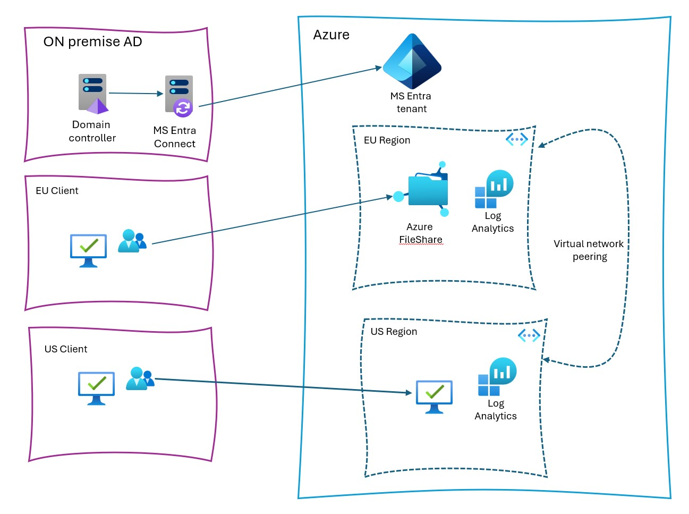

# Use Azure file shares in a multi region environment

## Objective:

Setup two Azure region (for example EU, US) connected to each other using VNET peering. The EU configuration will host a file share providing upload and download capabilities, serving single and parallel downloads from multiple clients. 

Also it is optimize for best performance and provide proof with measurements. Additionally, create a secure and authenticated/authorized connection concept from a US office to the web service hosted in the EU. IaC is managed by Terraform.

## Architecture:

This architecture shows how to include Azure file shares in your hybrid environment. Azure file shares are used as serverless file shares. By integrating them with Active Directory Domain Services (AD DS), you can control and limit access to AD DS users. Azure file shares then can replace traditional file servers.

## Components

Key technologies used to implement this architecture:

Microsoft Entra ID is an enterprise identity service that provides single sign-on, multifactor authentication, and conditional access.
Azure Files offers fully managed file shares in the cloud that are accessible by using the industry standard protocols.

## Scalability

Azure file share size is limited to 100 tebibytes (TiB). There's no minimum file share size and no limit on the number of Azure file shares.
Maximum size of a file in a file share is 1 TiB, and there's no limit on the number of files in a file share.
IOPS and throughput limits are per Azure storage account and are shared between Azure file shares in the same storage account.

## Security

Use AD DS authentication over SMB for accessing Azure file shares. This setup provides the same seamless single sign-on (SSO) experience when accessing Azure file shares as accessing on-premises file shares. Your client needs to be domain joined to AD DS, because the authentication is still done by the AD DS domain controller. Also, you need to assign both share level and file/directory level permissions to get access to the data. Share level permission assignment goes through Azure RBAC model. File/directory level permission is managed as Windows ACLs.

 
All data that's stored on Azure file share is encrypted at rest using Azure storage service encryption (SSE). By default, data stored in Azure Files is encrypted with Microsoft-managed keys. With Microsoft-managed keys, Microsoft maintains the keys to encrypt/decrypt the data and manages rotating them regularly. You can also choose to manage your own keys, which gives you control over the rotation process.

All Azure storage accounts have encryption in transit enabled by default. This setup means that all communication with Azure file shares is encrypted. Clients that don't support encryption can't connect to Azure file shares. 

By default, clients can connect to Azure file share from anywhere. To limit the networks from which clients can connect to Azure file shares, configure the Firewall, virtual networks, and private endpoint connections. 